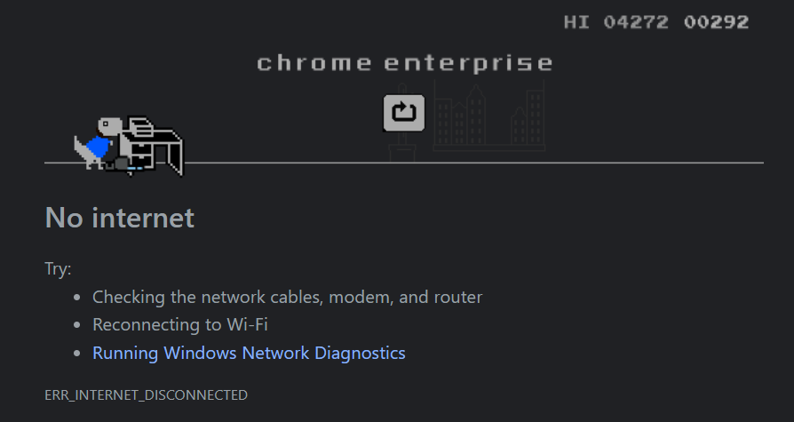

### **Desafio: Criar o Jogo do Dinossauro Offline com API para Salvar Resultados**

---

### **Descrição Geral**

Este desafio tem como objetivo consolidar os conhecimentos básicos de **HTML**, **CSS** e **JavaScript**, além de introduzir o desenvolvimento de APIs e a integração com front-end. A ideia é recriar o clássico jogo do dinossauro offline (do navegador Chrome), onde o jogador controla um dinossauro que precisa desviar de obstáculos.

Além do jogo, vocês deverão implementar uma API para salvar os resultados dos jogadores e integrá-la ao front-end. Para deixar o jogo mais interativo, será necessário incluir **efeitos sonoros**, como sons de pulo, colisão e quando o jogador alcança um marco de pontuação.

---

### **Objetivos do Projeto**

1. **Front-End**:

   - Criar a interface do jogo utilizando HTML e CSS.
   - Desenvolver a lógica do jogo com JavaScript.
   - Adicionar sons que sejam ativados durante o jogo.

2. **Back-End**:

   - Criar uma API para salvar e listar os resultados dos jogadores.

3. **Integração**:
   - Fazer o front-end consumir os endpoints da API.

---

### **Requisitos do Jogo**

#### **1. Estrutura e Estilo (HTML e CSS)**

- Criar uma página inicial com:
  - O título do jogo.
  - Um botão para começar o jogo.
- Criar a interface do jogo:
  - Um dinossauro (pode ser representado por uma imagem ou um quadrado).
  - Obstáculos (como cactos ou qualquer outro elemento visual simples).
- Estilizar o jogo para uma aparência amigável e clara:
  - Definir o "chão" e o "céu".
  - Tornar o layout responsivo para diferentes tamanhos de tela.

#### **2. Lógica e Interatividade (JavaScript)**

- Implementar os controles:
  - O dinossauro deve pular ao pressionar uma tecla (como espaço ou seta para cima).
- Criar obstáculos:
  - Os cactos devem se mover da direita para a esquerda da tela.
  - Novos cactos devem aparecer periodicamente.
- Detecção de colisões:
  - Verificar se o dinossauro colidiu com um cacto.
  - Mostrar "Game Over" e reiniciar o jogo após o jogador pressionar um botão.
- Contador de pontos:
  - Contar e exibir os pontos com base no tempo que o jogador sobreviveu.

#### **3. Sons**

- Adicionar efeitos sonoros para melhorar a experiência do jogador:
  - Som de pulo: ativado quando o jogador pula.
  - Som de colisão: tocado quando o dinossauro bate em um obstáculo.
  - Som de marco de pontuação: tocado a cada 100 pontos alcançados.
- Incorporar arquivos de áudio simples no jogo e carregar os sons antes de iniciar a partida.

#### **4. API para Salvar Resultados**

- Criar uma API simples que permita:
  - **Salvar resultados** (`POST /scores`): Receber o nome do jogador e sua pontuação.
  - **Listar resultados** (`GET /scores`): Retornar uma lista dos melhores resultados.
- Utilizar um banco de dados leve como SQLite ou salvar os dados em um arquivo JSON.

#### **5. Integração Front-End e API**

- Fazer requisições à API para:
  - Enviar o resultado do jogo ao final da partida.
  - Exibir um ranking com as melhores pontuações na página.

---

### **Passo a Passo para Construção**

#### **1. Front-End:**

- Estruturar o HTML para incluir elementos como o dinossauro, os obstáculos, e a pontuação.
- Usar CSS para criar animações e estilos que tornem o jogo visualmente agradável.
- Implementar a lógica com JavaScript para:
  - Controlar o movimento do dinossauro e dos obstáculos.
  - Detectar colisões.
  - Incrementar e exibir a pontuação.
- Incluir sons usando a API de áudio do navegador ou bibliotecas simples.

#### **2. Sons:**

- Escolher sons apropriados e otimizados (formato `.mp3` ou `.wav`).
- Usar ferramentas como [Freesound](https://freesound.org/) ou [Zapsplat](https://www.zapsplat.com/) para encontrar sons gratuitos.
- Criar uma pasta no projeto para armazenar os arquivos de áudio.
- Implementar os sons no jogo para:
  - Reproduzir o som de pulo quando o jogador pressionar a tecla de salto.
  - Tocar o som de colisão ao detectar o impacto.
  - Reproduzir um som especial ao atingir marcos de pontuação.

#### **3. Back-End:**

- Configurar um servidor simples usando **Node.js** e **Express**.
- Criar os endpoints para salvar e listar resultados.
- Usar um banco de dados ou arquivo JSON para armazenar os dados.

#### **4. Integração:**

- Fazer o front-end consumir os endpoints da API para salvar e recuperar os resultados.
- Exibir os melhores resultados em uma tabela na página inicial ou ao final do jogo.

---

### **Materiais de Apoio**

1. **HTML e CSS:**

   - [MDN Web Docs - HTML](https://developer.mozilla.org/pt-BR/docs/Web/HTML)
   - [MDN Web Docs - CSS](https://developer.mozilla.org/pt-BR/docs/Web/CSS)

2. **JavaScript e Sons:**

   - [MDN Web Docs - Manipulando Áudio](https://developer.mozilla.org/pt-BR/docs/Web/API/HTMLAudioElement)
   - [Tutorial de Efeitos Sonoros com JS](https://www.freecodecamp.org/news/adding-sound-effects-to-your-web-apps/)

3. **Node.js e APIs:**

   - [Documentação do Node.js](https://nodejs.org/)
   - [Documentação do Express.js](https://expressjs.com/pt-br/)

4. **Ferramentas de Áudio:**
   - [Freesound](https://freesound.org/)
   - [Zapsplat](https://www.zapsplat.com/)

---

### **Entrega Final**

- **Código:** Organizado e bem comentado, hospedado em um repositório (como GitHub).
- **Funcionalidade:** Testar se o jogo funciona, incluindo sons e integração com a API.
- **Documentação:** Adicionar um README explicando como rodar o projeto.

---

Com esse desafio, as estagiárias terão contato com conceitos de desenvolvimento completo (front-end + back-end) e criarão algo divertido e interativo! 🚀
